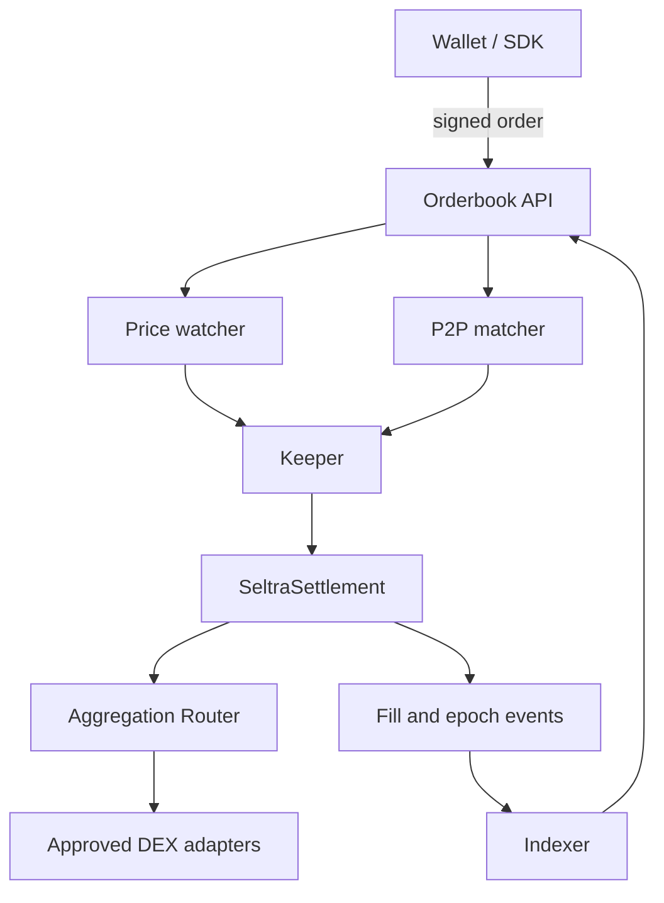

A complete Seltra integration has four cooperating components:

1. A wallet or SDK that constructs and signs Permit2 witness orders.
2. An orderbook service that validates and distributes resting orders.
3. A keeper that simulates and submits executable fills.
4. An indexer that reconciles fills and cancellations from chain data.

### Integration principles

* Treat simulation as mandatory immediately before submission.
* Use integer arithmetic for every amount and crossing check.
* Read adapter availability from `isRegistered(adapterId)` before advertising a quote.
* Persist the Permit2 nonce with the order so a maker can cancel precisely.
* Reconcile status from on-chain events and Permit2 nonce state, not only from API state.
* Keep private keys out of frontend and repository environments.

<Callout type="warning">

Fuji demo tokens are open-mint test assets. They have no economic value and must never be represented as production WAVAX or USDC.

</Callout>
