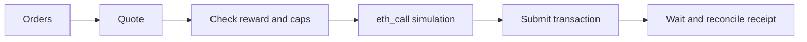

Keepers are permissionless transaction submitters. Their core loop is:

### DEX fills

1. Read `router.isRegistered(adapterId)`.
2. Quote the full `makingAmount` using venue-appropriate `extra`.
3. Require quoted output to meet `takingAmount`.
4. Estimate keeper-side surplus and enforce minimum profit.
5. Simulate `fillOrderDEX` at latest state.
6. Submit only if simulation succeeds.

### P2P fills

Match opposite assets, exact base size, and crossed integer prices. Simulate the complete two-order call before submission.

### Production safeguards

* Maintain one in-flight key per order or matched pair.
* Treat nonce races as expected failures.
* Enforce per-order and daily notional caps.
* Bound quote age and price deviation.
* Alert on revert spikes, pause events, and near-limit fill streaks.
* Use isolated funded keeper keys and explicit RPC failover.

The reference implementation lives in `services/src/keeper.ts`.
