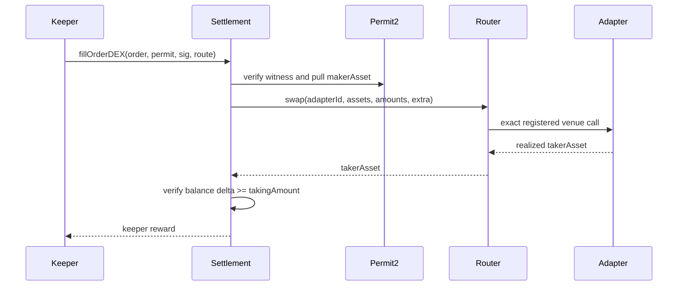

The DEX path fills one maker order through a registered adapter.

The keeper chooses only `adapterId` and venue-specific `extra`. Token addresses, input size, minimum output, and proceeds receiver come from the signed order.

Settlement measures the taker token balance before and after routing. It does not trust a venue's return value for maker accounting.

### Preconditions

* Fills are globally unpaused.
* Both tokens are allowlisted.
* The order is unexpired and on the current maker epoch.
* The Permit2 payload matches the order.
* The adapter exists and is not paused.
* Realized output is at least `takingAmount`.

The entire flow is atomic. Any failed check reverts the token pull, swap, nonce consumption, and transfers.
