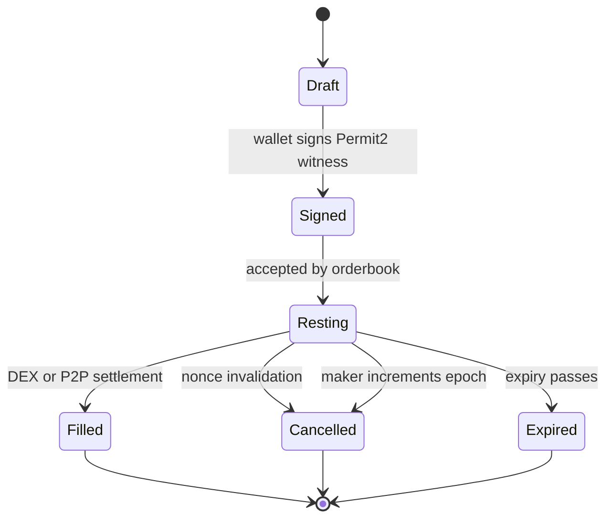

Seltra separates **order creation** from **order execution**. Makers authorize exact exchange terms with a Permit2 witness signature. Services can distribute and match those signed intents, but only `SeltraSettlement` can consume the permit and enforce the trade.

### Lifecycle

1. **Construct:** choose assets, exact input, minimum output, receiver, expiry, and authorization fields.
2. **Sign:** sign one Permit2 `PermitWitnessTransferFrom` message whose witness is the Seltra order.
3. **Rest:** submit the signed payload to an order service. No Seltra transaction is required from the maker.
4. **Discover:** watchers quote registered DEX adapters while the matcher looks for crossing orders.
5. **Simulate:** a keeper runs the exact fill as an `eth_call` against current state.
6. **Settle:** Permit2 verifies the signature, transfers the maker asset, and consumes the nonce atomically.
7. **Distribute:** Settlement enforces the signed minimum and pays improvement, keeper reward, and any configured protocol fee.

<Callout type="info">

The first valid transaction to consume a Permit2 nonce wins. Competing or replayed fills revert atomically.

</Callout>
