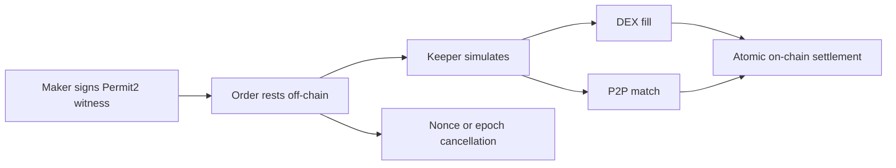

Seltra combines an off-chain orderbook with deterministic on-chain settlement. The protocol keeps order creation inexpensive for makers while preserving on-chain enforcement of signatures, limits, token policy, cancellation, and execution results.

### Mental model

A Seltra order is a signed instruction to exchange an exact amount of one token for at least a minimum amount of another token. The order rests off-chain until a keeper finds an executable route.

### What the contracts enforce

| Property           | Enforcement                                           |
| ------------------ | ----------------------------------------------------- |
| Maker identity     | Permit2 witness signature                             |
| Replay protection  | Permit2 unordered nonce                               |
| Minimum proceeds   | Signed `takingAmount` plus exact recipient delivery   |
| Order expiry       | Signed `expiry` checked at fill time                  |
| Mass cancellation  | Maker epoch                                           |
| Private execution  | Optional `allowedSender`                              |
| Supported assets   | Settlement token allowlist                            |
| Supported venues   | Write-once router adapter registry                    |
| Emergency response | Global fill pause and per-adapter pause               |

<Callout type="success">

A keeper cannot change the token pair, order size, minimum output, receiver, expiry, maker epoch, or authorized sender. Those values are all bound into the maker's signed witness.

</Callout>

Continue through the pages in this section for the order model, execution paths, incentives, and cancellation behavior.
