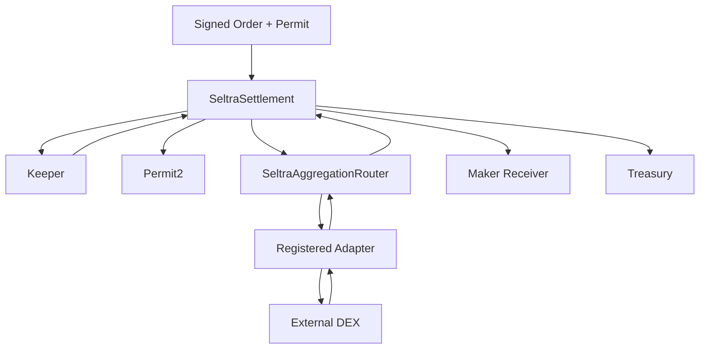

The deployed runtime is intentionally small and non-upgradeable. Mutable policy is isolated behind owner functions intended for delayed governance.

### Trust boundaries

* **Maker:** authorizes exact order terms and Permit2 token transfer.
* **Keeper:** selects execution timing and an approved route, but cannot change signed economics.
* **Settlement:** validates and distributes funds.
* **Router:** limits external execution to registered adapter code.
* **Adapter:** translates a constrained route into venue-specific calls.
* **Guardian:** can stop fills or one venue immediately.
* **Owner/Timelock:** controls allowlists, parameters, registration, guardians, and unpausing.

Settlement and Router use `Ownable2Step` to avoid accidental ownership transfer.
