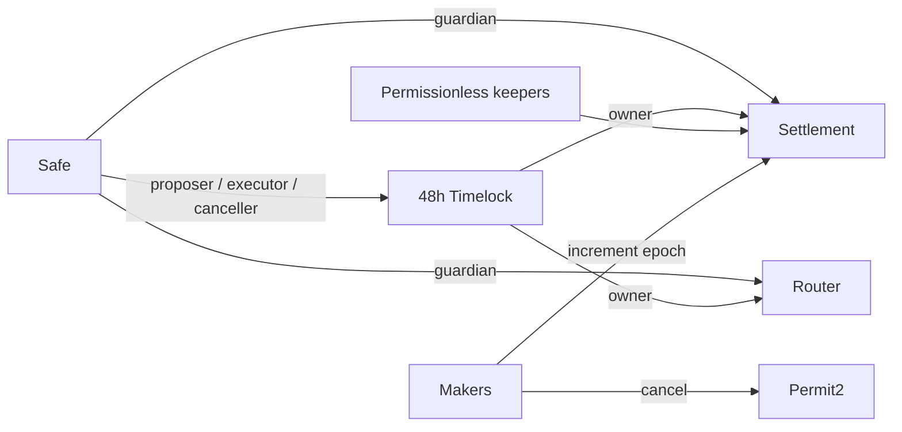

The intended topology separates fast emergency response from delayed recovery and policy changes.

| Capability                | Principal             |    Delay |
| ------------------------- | --------------------- | -------: |
| Fill valid orders         | Any keeper            |     None |
| Cancel one order          | Maker through Permit2 |     None |
| Cancel all maker orders   | Maker                 |     None |
| Pause all fills           | Settlement guardian   |     None |
| Pause one adapter         | Router guardian       |     None |
| Unpause                   | Owner/Timelock        | 48 hours |
| Change token policy       | Owner/Timelock        | 48 hours |
| Change surplus parameters | Owner/Timelock        | 48 hours |
| Register adapter          | Owner/Timelock        | 48 hours |
| Rotate guardians          | Owner/Timelock        | 48 hours |

Fuji uses a 1-of-1 Safe to exercise this topology. Mainnet requires a separately reviewed distributed signer threshold and operating policy.
