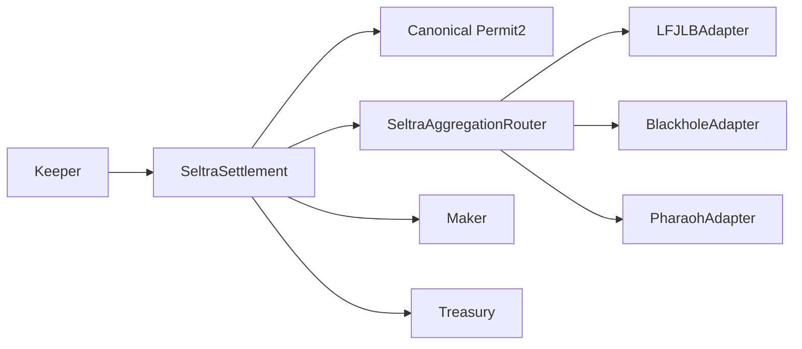

Seltra's contracts separate order economics from venue execution. `SeltraSettlement` verifies the maker-authorized order and distributes proceeds. `SeltraAggregationRouter` dispatches only to registered adapters, and each adapter contains venue-specific calldata.

### Deployed contract roles

| Component                 | Responsibility                                                                                             |
| ------------------------- | ---------------------------------------------------------------------------------------------------------- |
| `SeltraSettlement`        | Signature-bound economics, Permit2 pulls, limits, surplus split, P2P matching, cancellations, token policy |
| `SeltraAggregationRouter` | Settlement-only dispatch, adapter registry, per-adapter pause                                              |
| `LFJLBAdapter`            | LFJ Liquidity Book quotes and swaps                                                                        |
| `BlackholeAdapter`        | Allowlisted Blackhole V1 pool routes                                                                       |
| `PharaohAdapter`          | Pharaoh concentrated-liquidity quotes and swaps                                                            |
| `MockDEXAdapter`          | Test-only deterministic pricing on Fuji                                                                    |
| Permit2                   | Signature verification, token pull, unordered nonce replay protection                                      |
| TimelockController        | Delayed privileged actions                                                                                 |
| Safe                      | Staging guardian and timelock proposer/executor/canceller                                                  |

### Design boundaries

* No arbitrary target calls or keeper-provided calldata targets.
* No `delegatecall`.
* Adapter IDs are write-once.
* Router swaps are callable only by Settlement.
* Venue return values are not trusted for settlement accounting; balance deltas are authoritative.
* Approvals are exact and cleared after execution.

Use the child pages for function-level behavior, events, adapter data, and governance.
