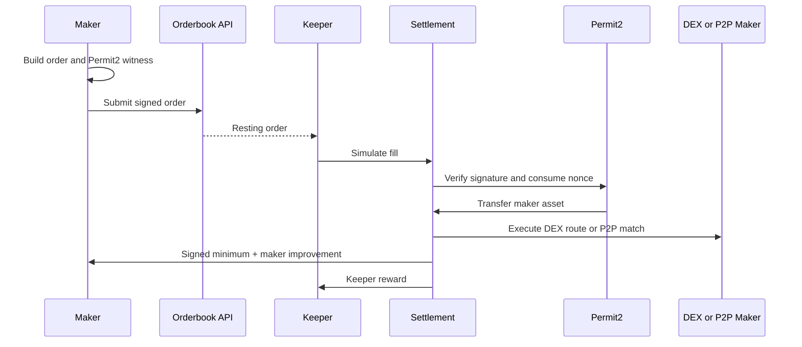

Seltra is a hybrid limit-order protocol for Avalanche. Makers sign orders off-chain through Permit2, while permissionless keepers settle them on-chain through either aggregated DEX liquidity or a direct peer-to-peer match.

<Callout type="info">

**Current status:** Seltra is deployed on Avalanche Fuji for testing. The mainnet contracts are not yet deployed and the protocol should not be treated as independently audited.

</Callout>

### Why Seltra

<CardGrid>
  <Card icon="✍️" title="One maker signature">
    Orders use Permit2 witness signatures. Makers do not submit an on-chain order transaction.
  </Card>
  <Card icon="🔀" title="Two execution paths">
    Settle against approved AMM adapters or match two crossing makers directly.
  </Card>
  <Card icon="🛡️" title="Maker-protective settlement">
    The maker always receives at least the signed minimum. Positive execution surplus is shared transparently.
  </Card>
  <Card icon="🧩" title="Composable contracts">
    Integrate orders, keepers, indexers, and venue adapters through a compact on-chain interface.
  </Card>
</CardGrid>

### How an order moves

### Start here

* **New to the protocol?** Read [Concepts](/docs/concepts).
* **Building an integration?** Start with [Build with Seltra](/docs/build-with-seltra).
* **Reviewing Solidity?** Open the [Contract Reference](/docs/contract-reference).
* **Connecting to Fuji?** Use [Networks & Deployments](/docs/networks-and-deployments).
* **Evaluating risk?** Read [Security](/docs/security).

The public source repository is available at [Seltra-Finance/Limit-Order](https://github.com/Seltra-Finance/Limit-Order).
